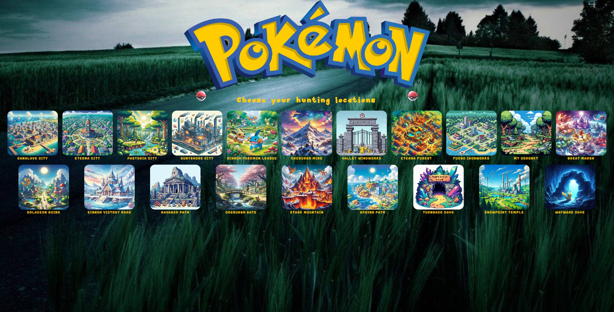
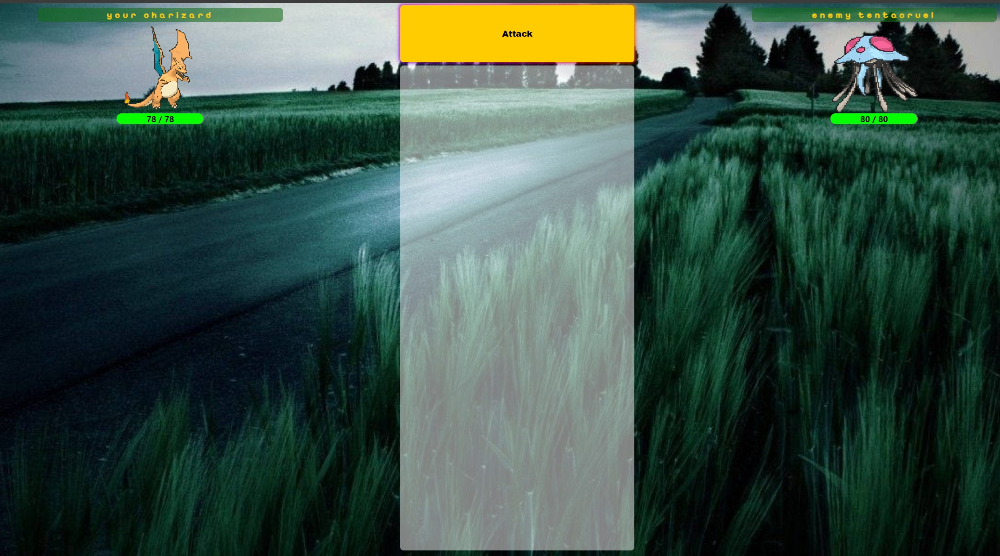

# Fetch the Pokemon 

This project is a Pokémon-themed website built with React and containerized using Docker. It leverages the Pokémon API to allow users to select areas, explore locations, and engage in Pokémon battles. The goal is to provide a fun and interactive experience for Pokémon fans.

## Table of Contents
- [Fetch the Pokemon](#fetch-the-pokemon)
  - [Table of Contents](#table-of-contents)
  - [Project Overview](#project-overview)
  - [Features](#features)
  - [Installation](#installation)
  - [Usage](#usage)
  - [Docker Setup](#docker-setup)
  - [Screenshots](#screenshots)
    - [Area Selection](#area-selection)
    - [Pokémon Battle](#pokémon-battle)
  - [API Information](#api-information)
  - [Contributors](#contributors)
  - [License](#license)

---

## Project Overview

This project was developed by a team of three developers. It is a fully interactive website where users can explore different areas from the Pokémon world, select locations, choose Pokémon, and engage in battles. The application uses the Pokémon API to fetch Pokémon data and render various battle statistics.

---

## Features

- **Area and Location Selection**: Users can choose from different areas in the Pokémon universe and navigate through various locations.
- **Pokémon Battle System**: Users can select their Pokémon and an enemy Pokémon to engage in a turn-based battle.
- **Real-time API Data**: The website uses the Pokémon API to retrieve live data on Pokémon, including their stats, abilities, and types.

---

## Installation

To install and run the project locally, follow these steps:

1. **Clone the repository**:
   ```bash
   git clone https://github.com/Nuubshybot/fetch-the-pokemon.git
   cd pokemon-website 
    ```
2.  **Install dependencies**:
    ```bash    
    npm install
     ```
3.  **Start the development server**:
    
    ```bash
    npm start
     ``` 
The website will be available at `http://localhost:3000`.

----------

## Usage

1.  **Select an Area**: After loading the website, you can choose from different areas of the Pokémon world.
2.  **Choose a Location**: Once the area is selected, explore various locations within that area.
3.  **Battle Setup**: Select your Pokémon and the enemy Pokémon. The battle will simulate using stats retrieved from the API.
4.  **Engage in Battle**: Use turn-based actions to defeat the enemy Pokémon, with real-time stats being displayed for each action.

----------

## Docker Setup

To run the project using Docker, follow these steps:

1.  **Build the Docker image**:
    
    ```bash
    docker build -t pokemon .
    ```
2.  **Run the Docker container**:
    
    ```bash
    docker run -p 3000:3000 -d pokemon
    ```
3.  Once the containers are up, access the website at `http://localhost:3000`.
    

----------

## Screenshots

### Area Selection


### Pokémon Battle


----------

## API Information

This project uses the [PokéAPI](https://pokeapi.co/) to retrieve Pokémon data. The API provides detailed information about each Pokémon, including stats, types, and abilities, which are dynamically fetched and displayed during battles.

----------

## Contributors

-   **Zoli** - [@NuubShybot](https://github.com/Nuubshybot)
-   **Samu** - [@nionys](https://github.com/nionys)
-   **Attila** - [@Attila112](https://github.com/Attila112)

## License
This project is licensed under the MIT License.
